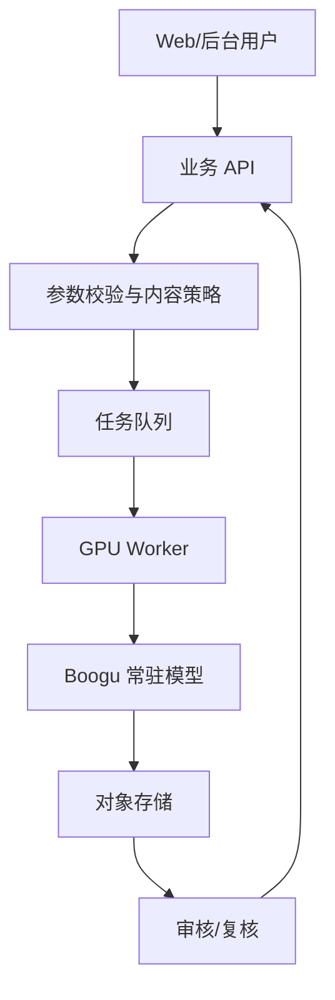

# 产品化机会与集成建议

## 适合优先验证的方向

### 1. 电商商品图生成/修图

适合场景：

- 白底商品主图。
- 商品海报。
- 背景替换。
- 商品颜色/材质改造。
- 简单营销文案入图。

为什么适合：

- 上游强调产品图、海报、中文/英文文字渲染。
- Edit 模型支持图像编辑。
- Turbo 模型适合快速出草图，Base/Edit 适合更高质量结果。

需要补的能力：

- 商品主体一致性检测。
- 品牌词和禁用词规则。
- 文字 OCR 校验。
- 人工复核队列。

### 2. 中文海报和短视频封面工具

适合场景：

- 小红书/抖音封面。
- 活动海报。
- 产品卖点图。
- 课程、直播、门店促销图。

Boogu 的优势点在于中文视觉 prompt、中文文字渲染和布局类重写 prompt。上游还有 `ppt` rewriter preset，可用于报告、幻灯片、信息图类生成。

产品设计建议：

- 不给用户裸 prompt 框，而是给模板：标题、副标题、主体、风格、尺寸、配色、禁用元素。
- 对生成图做 OCR，把文字错误标出来，允许二次生成或局部修正。
- 保存每次生成参数，做同款批量变体。

### 3. 内容生产后台

适合内部运营团队：

- 运营图批量生成。
- 文章配图。
- 活动 banner。
- SKU 批量背景替换。

后台应采用任务队列，而不是同步等待。建议流程：

### 4. ComfyUI 工作流

上游已发布 `ComfyUI-Boogu`。如果目标用户是设计师、AI 绘图玩家或内部视觉团队，优先接 ComfyUI 可能比直接写 API 更快。

适用：

- 快速验证能力。
- 给设计师可视化搭工作流。
- 和已有 ComfyUI 节点生态结合。

不适用：

- 面向普通终端用户的大规模 SaaS。
- 需要强权限、强审核、强计费的业务场景。

## 不建议优先做的方向

| 方向 | 原因 |
| --- | --- |
| 完全自动商用修图替代人工 | 图生图一致性和细节稳定性仍需人工复核 |
| 强身份保持的人像产品 | 上游说明主体/身份/布局精细保持仍有限 |
| 无审核开放生成平台 | 内容安全和合规风险高 |
| 低成本高并发 API 转售 | 10B 模型 + 2K 输出的 GPU 成本不低，上游也提醒没有官方收费服务 |
| 长文本设计稿自动成片 | 密集文字仍可能错字、缺字、漂移 |

## 业务集成架构

建议把 Boogu 放在内网推理服务里，业务系统不要直接调用脚本。

服务层至少提供：

| API | 作用 |
| --- | --- |
| `POST /jobs` | 创建生成/编辑任务 |
| `GET /jobs/{id}` | 查询任务状态 |
| `GET /jobs/{id}/outputs` | 查看结果 |
| `POST /jobs/{id}/rerun` | 按同参数重跑或改 seed |
| `POST /moderation/review` | 人工审核 |
| `GET /models/presets` | 返回可用模型和 preset |

## 推荐 MVP

第一版不要追求大而全，建议做：

1. 两个模式：商品主图、中文海报。
2. 两个模型：Turbo 预览、Base/Edit 精修。
3. 三个尺寸：1024x1024、1024x1536、1536x1024。
4. 一个队列：单 GPU 串行或小并发。
5. 基础审核：敏感词、品牌词、OCR 错字检查、人工确认。
6. 日志：prompt、重写 prompt、seed、模型版本、耗时、显存、输出路径。

## 成本判断

成本主要来自：

- GPU 显存规格。
- 2K 输出的推理时长。
- 是否启用 Base/Edit 而不是 Turbo。
- 是否启用本地 rewriter。
- 并发和排队体验要求。

如果只是内部工具，24GB-48GB 单卡可以先做验证；如果要对外服务，建议从队列式、低并发、按任务计费开始，不要承诺即时高并发。

